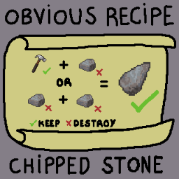

# Project Zomboid Mod - Obvious Recipe - Chipped Stone

Create Chipped Stone in what I think is the obvious way.

## Installing the mod:

### Manual:

- Copy the `Contents/mods/ObviousRecipesChippedStoneMod` folder inside `/mods` in your Project Zomboid installation.

### Steam Workshop:

- Subscribe [here](https://steamcommunity.com/sharedfiles/filedetails/?id=2704468416)

## Recipes:

### Make Chipped Stone

- 1 Hammer / Stone Hammer / Ball-peen Hammer (keep)
- 1 Stone

### **OR**

### Make Chipped Stone

- 2 Stones

